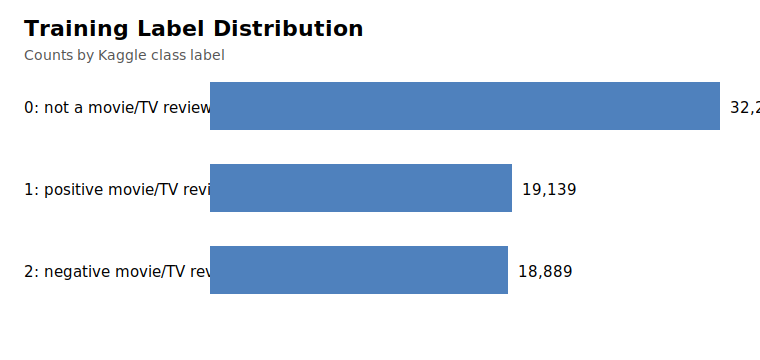

# Data Analysis

This report documents the Kaggle files used for the first baseline submission.

## Column Checks

| Dataset | Path | Rows | Columns | Empty values | Duplicate IDs |
| --- | --- | --- | --- | --- | --- |
| train | data/train.csv | 70,317 | ID, TEXT, LABEL | {'ID': 0, 'TEXT': 7, 'LABEL': 0} | 0 |
| test | data/test.csv | 17,580 | ID, TEXT | {'ID': 0, 'TEXT': 0} | 0 |
| sample submission | data/sample_submission.csv | 17,580 | ID, LABEL | {'ID': 0, 'LABEL': 0} | 0 |

## Label Distribution

| Label | Meaning | Count | Percent |
| --- | --- | --- | --- |
| 0 | not a movie/TV review | 32,289 | 45.92% |
| 1 | positive movie/TV review | 19,139 | 27.22% |
| 2 | negative movie/TV review | 18,889 | 26.86% |

## Text Lengths

Word-count summary after splitting on whitespace:

| Dataset | Min | Median | Mean | Max |
| --- | --- | --- | --- | --- |
| train | 0 | 104.0 | 148.7 | 6021 |
| test | 0 | 105.0 | 148.2 | 4295 |

## Submission ID Check

- Sample submission IDs all appear in `data/test.csv`: `True`.
- `data/test.csv` has `0` IDs that are not present in `data/sample_submission.csv`.
- Train/test ID overlap count: `0`.

Because Kaggle validates the uploaded file against the sample-submission shape, submission generation predicts labels only for the IDs in `data/sample_submission.csv` and preserves that order.
